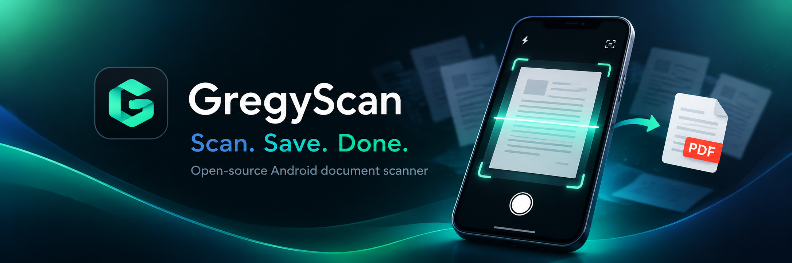
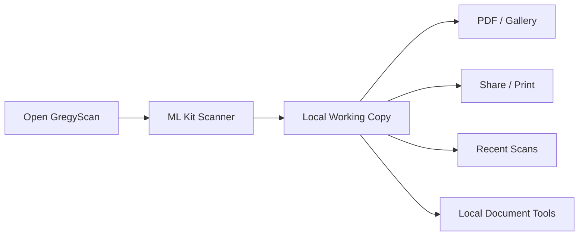

# GregyScan

**Scan. Save. Done.**

GregyScan is a free and open-source Android document scanner focused on a simple, fast and reliable workflow from scanning a document to saving, sharing or printing the final result.

The project is currently developed and maintained by **Gregor Dolar**.

GregyScan continues the development of the open-source **ScanIt / SeliaScan** project. Original authorship, historical licensing information and third-party attribution are preserved in this repository.

---

## Current release

### GregyScan 1.0.0

The current stable release is **v1.0.0**.

**Download the latest version:**

https://github.com/GregorDolar/GregyScan/releases/latest

The APK can be installed manually on a compatible Android device.

GregyScan supports **Android 10 and newer**.

---

## Why GregyScan exists

Scanning and sending a document should not require navigating complicated file managers, export dialogs or cloud services.

Open GregyScan, scan one or more pages, review the result and then save, share or print the document.

The goal is a clean workflow:

**Scan → Review → Save → Share**

---

## Features

### Document scanning

- Google ML Kit Document Scanner
- Automatic page detection
- Automatic capture
- Crop and rotation
- Scanner filters
- Shadow removal and cleanup
- Single-page and multi-page scanning
- High-resolution document processing

### PDF and image output

- PDF creation
- JPEG export
- PNG export
- Original image export
- Configurable PDF size
- Custom PDF size targets
- Configurable image size and format
- Save to Downloads or a selected folder
- Save images to Gallery

### Document management

- Recent scans dashboard
- Multi-page document browsing
- Full-screen zoomable document preview
- Rename PDF and image files
- Change output folder
- Re-create deleted output files
- Explicit deletion of saved documents

### Document actions

- OCR text extraction
- Export recognized text
- QR code detection
- Barcode detection
- Read recognized text aloud
- Smart cleanup
- Manual cleanup
- Manual redaction
- Safe Share tools

### Signatures and stamps

GregyScan supports reusable visual signatures and stamps.

They can be:

- drawn
- imported
- scanned
- moved directly on the document
- resized
- rotated
- positioned manually

Visual signatures and stamps are image annotations. They are **not cryptographic digital signatures** and do not verify identity or document authenticity.

### Sharing and printing

- Android Sharesheet
- Share PDF
- Share images
- Configurable email subject and message
- Android system printing
- Page-range printing

---

## Languages

GregyScan includes multiple interface languages, including:

- Slovenian
- English
- Czech
- German
- Spanish
- Simplified Chinese

The application can follow the Android system language or use a language selected in Settings.

---

## Privacy

GregyScan is designed around local document processing.

Ordinary scanning, PDF creation, OCR, barcode detection, document cleanup and redaction are performed on the device.

GregyScan does **not** operate a GregyScan cloud document service and does not upload scanned documents to a GregyScan-operated server.

Google Play services and Google ML Kit are used for document scanning and some recognition functionality. Required ML Kit modules may be downloaded by Google Play services before first use.

Sharing and printing transfer a document only after the user explicitly chooses another application or service.

Optional text-to-speech functionality uses the Android speech engine selected on the device. Depending on that engine, speech processing may occur online.

For more information see:

- [Privacy Policy](PRIVACY.md)
- [Security Policy](SECURITY.md)
- [Third-Party Notices](THIRD_PARTY_NOTICES.md)

---

## Permissions and storage

GregyScan uses Android's modern scoped-storage mechanisms.

The application does not require broad access to all files on the device.

Saved documents can use:

- MediaStore
- Android Storage Access Framework
- application-managed temporary storage

Recent scans are temporary working copies and are not intended to replace a permanent document archive.

Files explicitly saved by the user remain in their selected destination until deleted.

---

## Requirements

Current public builds require:

- Android 10 or newer
- `minSdk 29`
- `targetSdk 36`
- Google Play services for the ML Kit Document Scanner
- Internet connectivity when Google Play services needs to download or update scanner or recognition modules

---

## How GregyScan works



Scanned documents remain in local working storage while they are being processed.

Saved PDFs and images are written to user-accessible storage selected through Android.

---

## Building GregyScan

The project requires:

- JDK 17
- Android SDK 36

### Linux / WSL

```bash
./gradlew :app:testInternalDebugUnitTest
./gradlew :app:lintGithubRelease
./gradlew :app:assembleGithubRelease
```

### Windows

```powershell
.\gradlew.bat :app:testInternalDebugUnitTest
.\gradlew.bat :app:lintGithubRelease
.\gradlew.bat :app:assembleGithubRelease
```

The public GitHub build uses:

```text
Application ID:
com.gregordolar.gregyscan.github
```

Release signing uses local signing configuration.

Signing keys, passwords, keystores and other credentials must never be committed to Git.

---

## Technical stack

| Area | Technology |
|---|---|
| Language | Kotlin |
| UI | Jetpack Compose |
| Design | Material 3 |
| Scanner | Google ML Kit Document Scanner |
| OCR | Google ML Kit |
| Barcode / QR | Google ML Kit |
| Storage | MediaStore / Storage Access Framework |
| Sharing | Android Sharesheet / FileProvider |
| Settings | SharedPreferences |
| Build system | Gradle |

---

## Known limitations

- Recent scans are temporary working copies, not a permanent document library.
- Android decides which compatible applications appear in the Sharesheet.
- Automatic orientation correction requires sufficiently reliable text-line information.
- Google Play services may need to download ML Kit components before their first use.
- Visual signatures and stamps do not verify identity, authorization or document integrity.
- The repository does not contain production signing keys or passwords.

---

## Feedback and bug reports

Bug reports, suggestions and feature requests are welcome:

https://github.com/GregorDolar/GregyScan/issues

When reporting a problem, please include:

- GregyScan version
- Android version
- Device model
- Clear steps to reproduce the issue

Please **never upload private documents, passwords, credentials, API keys or other sensitive personal information** with a bug report.

See also:

[CONTRIBUTING.md](CONTRIBUTING.md)

---

## Support GregyScan

GregyScan is free and open source.

If GregyScan saves you time or makes document scanning easier, you can support its continued development with a coffee:

https://buymeacoffee.com/gregyscan

Support is completely optional and does not unlock features or change support priority.

---

## Maintainer

**Gregor Dolar**

GitHub:  
https://github.com/GregorDolar

Website:  
https://gregordolar.com

---

## Project history and attribution

GregyScan continues development based on earlier open-source work from **ScanIt / SeliaScan**.

The transition to GregyScan does not remove or replace the authorship, copyright notices or license rights associated with the original source code.

Historical information and applicable license notices are preserved in this repository.

See:

- [LICENSE](LICENSE)
- [LICENSES](LICENSES)
- [THIRD_PARTY_NOTICES.md](THIRD_PARTY_NOTICES.md)
- [HISTORICAL_MIT_RELEASES.md](HISTORICAL_MIT_RELEASES.md)
- [CHANGELOG.md](CHANGELOG.md)

---

## License

GregyScan is distributed under the open-source license terms contained in this repository.

Existing copyright notices and licensing terms covering the original ScanIt / SeliaScan source remain applicable to that code.

Additional GregyScan development is distributed subject to the applicable repository license.

See:

[LICENSE](LICENSE)

---

**GregyScan — Scan. Save. Done.**
